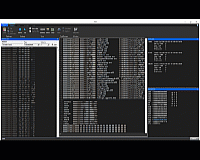

> ##### WIP github account: migrating stuff and articles from old blog.
##
###### ABOUT ME
##### Computer Engineer specializing in Windows&reg; software development with an emphasis on C/C++ and Assembly language, System Programming, Reverse Engineering, GPU, Graphics and Math. Tools:
* ###### C/C++ (up to C++23 draft), Assembly (x86 32/64, SIMD)
* ###### Win32, GDI, MFC, STL, Boost, OpenGL, CUDA, OpenCL, OpenCV, OpenMP, FMOD
* ###### Visual Studio, Perforce, git, JIRA, CMake, Hex-Rays IDA, WinDbg, VMware, Wireshark, SysInternals Suite.

<h5>PERSONAL PROJECTS

